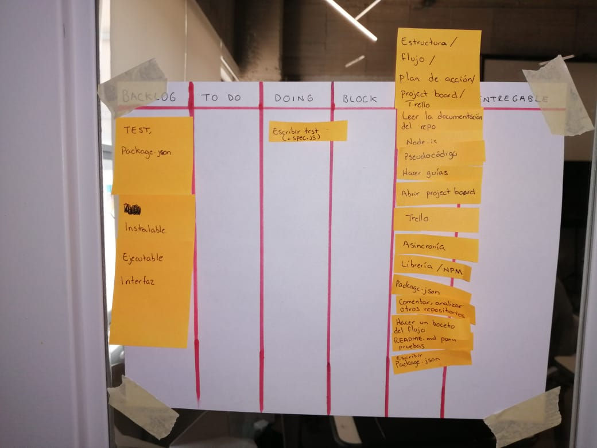
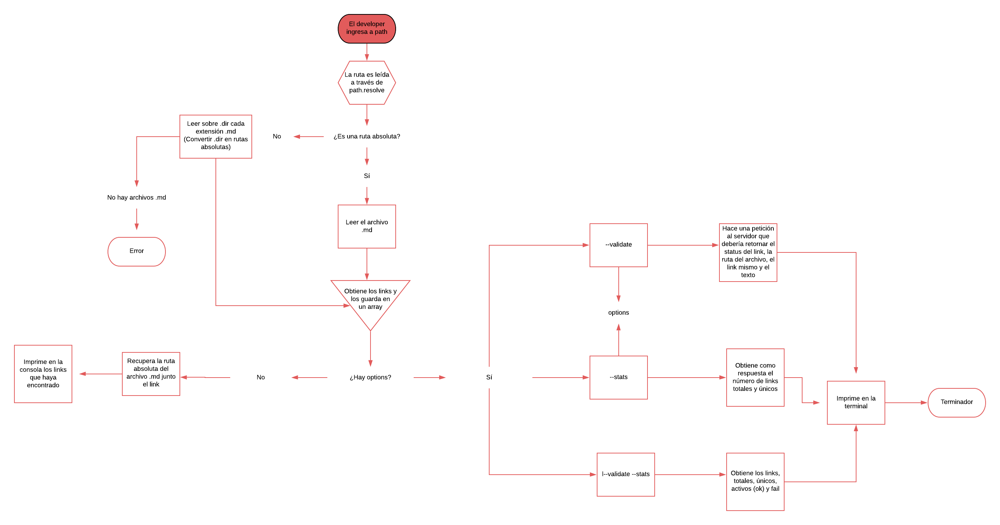

## MD-links-labo

## Preámbulo
[Markdown](https://es.wikipedia.org/wiki/Markdown) es un lenguaje de marcado
ligero muy popular entre developers. Aunque la sintaxis de markdown está orientada a publicar texto, muchas veces dichos archivos contienen links que añaden o complementan la información. 
Sin embargo, a veces esos links están caídos o no redireccionan a ninguna parte.

La solución que proporciona este proyecto es la devolución de una estadística de los links activos y caídos.

## ¿Qué es MD-links-labo?
Es una librería que sirve para devolver el número de links que contiene un archivo MD, así como el status de éstos.

## Objetivo del proyecto
Proporcionar una librería que ayude al usuario a depurar un archivo MD de links que no son funcionales. Los links se imprimen en la consola y muestran el 

## Documentación técnica de la librería.

Las herramientas y dependencias implementadas para la construcción de esta librería serán:

|Especificaciones técnicas|
| ---------------------- |
| **Lenguaje**           |
|JavaScript ECMAScript 6|
| **Ejecución**           |
|Node.js|
| **Dependencias y modulos NPM**|
|node-fetch              |
|File System             |
|Path                    |
| **Testing**            |
| Jest (pruebas unitarias)                    |
| **Otros**              |
|Línea de comando CLI|


## Instalación
Debes abrir la terminal y posicionarte en la carpeta donde quieres utilizar la librería para depurar los links en los archivos md. Debes ejecutar el comando `npm install md-links-labo`
Para ello debes haber instalado [node.js](https://nodejs.org/en/) previamente (al instalar node.js también se instala npm)

En caso de que necesites posicionarte fuera de esa carpeta (es decir, globalmente) puedes ejecutar el comando añadiendo -g
`npm install -g md-links-labo`

## Guía de uso:

## Uso mediante terminal
### Comportamiento por defecto (para obtener un listado de links)
 Habiendo instalado la librería previamente, ingresa `md-links-labo <ruta del archivo a depurar>` + enter. Debe imprimirse en la consola una lista de los links contenidos en el archivo MD. 

El comportamiento sólo identifica el archivo MD, lo analiza e imprime los links encontrados. Cada link es impreso junto con la ruta donde se encontró y el texto que contiene (limitado a 50 caracteres).

Para filtrar el status y la cantidad de links es necesario agregar opciones. 

### Options

#### --validate

`--validate` hace una petición HTTP para comprobar que el link esté activo. Si lo está debe retornar "ok", en caso contrario, retorna "false".

#### --stats
`--stats` retorna un texto con estadísticas simples de los links encontrados.

También es posible combinar ambas opciones para obtener estadísticas de links que hayan sido validados para comprobar su actividad. 

### Ejemplos

1. Para saber si los links están activos o no
Ingresa `md-links-labo <ruta del archivo a depurar> --validate`. La consola debe retornar "ok" cuando los links se encuentren activos y "false" cuando estén caídos.

2. Para saber cuántos links están activos y cuántos no
Ingresa `md-links-labo <ruta del archivo a depurar> --stats`. La consola debe retornar una lista de los links que funcionan y otra lista con los links caídos.

O también puede usarse a través de un archivo .js

## Usar MD-links-labo como API
Previamente instalada, puede llamarse la librería en un archivo .js, por ejemplo:

```js
    const beautifyMD: require(md-links-labo)

    mdLinks('archivoquequieresenchular.md');
```
Si además deseas filtrar los links o validarlo, puedes agregar como parámetro validate o stats:
```js
    const beautifyMD: require(md-links-labo)

    mdLinks('archivoquequieresenchular.md'), {stats: true}; //Puedes ingresar también stats, validate o ambos.
```

## Planeación

[Trello](https://trello.com/b/tQXTouQk/md-links)
[Project Board](https://github.com/vivianaberron/MEX008-FE-md-link/projects/1):



### Diagrama de flujo



### General

- [ ] Puede instalarse via `npm install --global <github-user>/md-links`

### `README.md`

- [X] Colocar el pseudo código o diagrama de flujo con el algoritmo que soluciona el problema.
- [X] Un board con el backlog para la implementación de la librería.
- [ ] Documentación técnica de la librería.
- [ ] Guía de uso e instalación de la librería

### API `mdLinks(path, opts)`

- [] El módulo exporta una función con la interfaz (API) esperada.
- [] Implementa soporte para archivo individual
- [] Implementa soporte para directorios
- [] Implementa `options.validate`

### Pruebas / tests

- [ ] Pruebas unitarias cubren un mínimo del 70% de statements, functions,
      lines, y branches.
- [ ] Pasa tests (y linters) (`npm test`).

## CLI

- [ ] Expone ejecutable `md-links` en el path (configurado en `package.json`)
- [ ] Se ejecuta sin errores / output esperado
- [ ] Implementa `--validate`
- [ ] Implementa `--stats`

## Hacker Edition

- [ ] Crear un script en el package.json que transforme el codigo ES6+ a ES5.
- [ ] Puedes agregar la propiedad line a cada objeto link indicando en qué línea del archivo se encontró el link.
- [ ] Puedes agregar más estadísticas.
- [ ] Integración continua con Travis o Circle CI.

## Autor

- Mayra Viviana Berrón Márquez